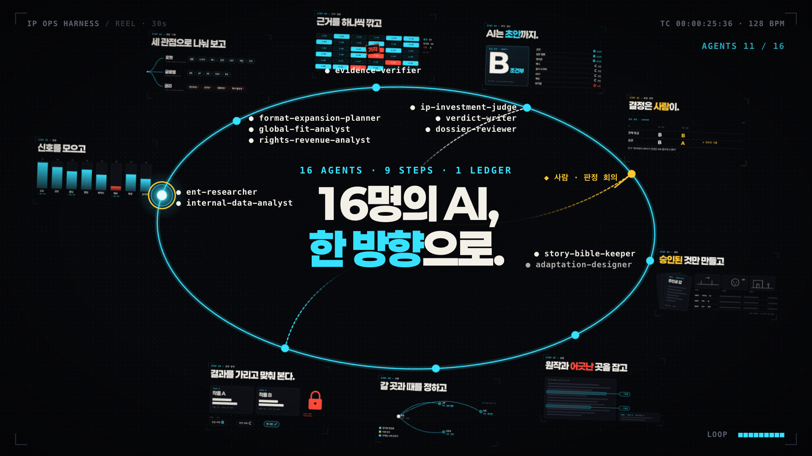

# IP 사업 운영 하네스

카카오엔터테인먼트가 가진 IP를 고르고 넓히는 판단을 Claude Code 에이전트 팀으로 운영하는 하네스다. IP 발굴부터 성과 분석까지 일곱 단계마다 역할별 AI가 근거와 등급 초안을 만들고, 사람이 내린 결정과 실제 결과를 판정 원장에 남겨 다음 판단 기준을 고친다.

[](deliverables/ip-harness-reel-30s.mp4)

30초 소개 영상: [`deliverables/ip-harness-reel-30s.mp4`](deliverables/ip-harness-reel-30s.mp4)

## 무엇에 답하나

CIPO의 질문은 하나다. "보유한 IP 하나의 가치를 얼마나 오래, 크게, 여러 사업에서 만들어 낼 수 있는가." 이 하네스는 카카오엔터테인먼트 CIPO 제안서에서 제안한 'IP 사업 운영 하네스'를 실제로 돌릴 수 있게 만든 것이다. 제안서 원문은 이 저장소에 없다.

## 일곱 단계

| 단계 | 하는 일 | 주요 산출물 |
| --- | --- | --- |
| ① 발굴 | 후보 IP 스캔, 공개 자료 신호 수집, 내부 집계 지표 분석 | 스크리닝 카드, 신호 카드, 내부 신호 카드 |
| ② 투자 판단 | 분석 문서에서 주장을 뽑아 원문과 다시 맞추고, 등급 초안(A\~D)과 포맷별 판정을 낸다 | 판정문, 판정서 |
| ③ 확장 기획 | 포맷 확장 지도, 국가별 시장 적합성, 권리·수익 구조 점검 | 확장 지도, 글로벌 진단, 권리 점검 |
| ④ 제작 지원 | 설정집, 피치 자료, 트리트먼트, 텍스트 콘티 | 설정집, 피치 자료 |
| ⑤ 검증 | 원작 일관성 검수, 권리 범위 점검, 출시 전 반응 테스트 설계 | 검수 결과, 반응 테스트 설계안 |
| ⑥ 유통 | 진출 국가·시점, 현지화 점검표, 마케팅 소재 요청서 | 유통 계획 |
| ⑦ 성과 분석 | 작품명을 가린 사후 검증, 적중표, 판단 기준 수정안 | 적중표, 수정안 |

IP 진단은 ① → ③ → ② 순서로 진행한다. 분석가 셋이 확장 지도·글로벌 진단·권리 점검을 먼저 쓰고, 심사위원이 그 문서에서 주장을 뽑는다. 검증자가 주장을 원문과 맞춘 뒤에야 심사위원이 등급을 낸다. 판정 회의는 사람이 하며, 원장에 사람의 결정이 기록되기 전에는 ④ 제작 지원을 시작하지 않는다.

## 운영 원칙

1. **준비와 결정을 나눈다.** AI는 근거와 등급 초안까지만 만든다. 원장에는 사용자가 전한 발언만 사람의 결정으로 적고, 침묵이나 짐작은 결정으로 기록하지 않는다.
2. **분석과 심사를 나눈다.** 같은 에이전트가 쓰고 심사하지 않는다.
3. **성과가 다음 판단으로 돌아온다.** 판정과 결정, 실제 결과를 날짜와 함께 원장에 쌓고, 셋을 대조해 판단 기준을 고친다.
4. **이미 있는 자산과 잇는다.** 사내 도구에는 요청서로 연결하고, 새 플랫폼이나 자체 모델은 만들지 않는다.
5. **데이터는 승인된 만큼만 본다.** 내부 지표는 보안 승인 기록이 있을 때만 스크립트로 계산한다.
6. **창작은 제작진이 결정한다.** 제작 준비물은 검토용이며 AI 이미지는 만들지 않는다.

## 구성

에이전트 16명, 스킬 14개, 워크플로 2개, 스크립트 3개로 이뤄져 있다.

### 에이전트

| 단계 | 에이전트 | 모델 | 맡는 일 |
| --- | --- | --- | --- |
| ① 발굴 | `ent-researcher` | sonnet | 공개 자료 조사와 사실 확인, 신호 카드 |
| ① 발굴 | `internal-data-analyst` | sonnet | 내부 집계 지표로 내부 신호 카드 작성 |
| ② 투자 판단 | `ip-investment-judge` | opus | 주장 추출, 등급 초안, 포맷별 판정, 뒤집기 조건 |
| ② 투자 판단 | `evidence-verifier` | sonnet | 주장을 원문과 다시 맞추기(판정은 하지 않음) |
| ③ 확장 기획 | `format-expansion-planner` | opus | 포맷 확장 지도와 확장 순서 |
| ③ 확장 기획 | `global-fit-analyst` | opus | 국가·지역별 시장 적합성과 현지화 항목 |
| ③·⑤ | `rights-revenue-analyst` | sonnet | 포맷별 필요 권리, 수익 누수, 법무 확인 질문 |
| ④ 제작 지원 | `story-bible-keeper` | sonnet | 캐릭터 설정집, 세계관 사전, 연표, 표기 사전 |
| ④ 제작 지원 | `adaptation-designer` | opus | 피치 자료, 트리트먼트, 텍스트 콘티 |
| ⑤ 검증 | `canon-consistency-checker` | opus | 원작 설정과 어긋난 곳 검수(읽기 전용) |
| ⑥ 유통 | `launch-planner` | sonnet | 진출 계획, 현지화 점검표, 마케팅 소재 요청서 |
| ⑦ 성과 분석 | `backtest-curator` | opus | 작품명을 가린 사후 검증 자료 |
| ⑦ 성과 분석 | `blind-panelist` | opus | 가린 자료만 보고 내리는 블라인드 판정 |
| ⑦·⑤ | `performance-analyst` | opus | 적중표, 판단 기준 수정안, 출시 전 반응 테스트 |
| 공통 | `verdict-writer` | sonnet | 판정 회의용 판정서, CIPO 보고서 |
| 공통 | `dossier-reviewer` | opus | 판정서가 판정문보다 밝게 옮겨진 곳 검토(읽기 전용) |

정해진 틀로 모으고 정리하는 일에는 sonnet을, 교차 검증·판정·창작·실험 설계에는 opus를 배정했다.

### 스킬

| 스킬 | 내용 |
| --- | --- |
| `ip-ops-harness` | 오케스트레이터. 요청을 분류해 일곱 단계와 에이전트를 조율한다 |
| `ent-research` | 공개 자료 조사, 신호 카드, 결정 시점 이전 자료만 모으는 컷오프 수집 |
| `internal-signal-analysis` | 보안 승인 확인 뒤 내부 집계 지표 계산과 해석 |
| `ip-investment-review` | 적대적 심사, 주장 추출, 등급 초안 |
| `format-expansion` | 포맷 확장 지도, 확장 순서, 하지 말아야 할 확장 |
| `global-fit` | 국가별 시장 적합성, 첫 진출 시장과 진입 포맷 |
| `rights-revenue-check` | 권리·수익 점검표(확장 기획 모드, 권리 범위 모드) |
| `story-bible` | 원작 회차 근거를 단 설정집 |
| `adaptation-pitch` | 피치 자료, 트리트먼트, 텍스트 콘티, 프리비주얼 지시서 |
| `canon-check` | 원작 일관성 검수 |
| `launch-planning` | 유통 실행 계획 |
| `backtest-protocol` | 블라인드 사후 검증 규약 |
| `performance-review` | 적중표, 원작 역유입 측정, 판단 기준 수정안 |
| `verdict-dossier` | 판정서와 CIPO 보고서 작성, 검토 점검표 |

### 워크플로와 스크립트

| 파일 | 하는 일 |
| --- | --- |
| `workflows/ip-scan.js` | 후보마다 스크리닝 카드를 만들어 심사하고, 심층 진단할 순서를 정한다 |
| `workflows/ip-diagnosis.js` | 신호 수집 → 확장 기획 3관점 → 주장 검증 → 판정 → 판정서 작성·검토를 이어서 실행한다 |
| `scripts/ledger.py` | 판정 원장. AI 판정, 사람의 결정, 실제 결과를 기록하고 대조한다 |
| `scripts/internal_metrics.py` | 보안 승인을 확인하고 개인 식별 열을 막은 뒤 내부 지표를 계산한다 |
| `scripts/blind_check.py` | 사후 검증 자료에 작품명이나 컷오프 이후 날짜가 새어 나갔는지 검사한다 |

## 폴더 구조

```text
.
├── CLAUDE.md                     # 하네스 호출 조건과 변경 이력
├── .claude/
│   ├── agents/                   # 에이전트 정의 16개
│   └── skills/                   # 스킬 14개
│       └── ip-ops-harness/
│           ├── SKILL.md          # 오케스트레이터
│           ├── references/       # 진단·제작·사후 검증·파일럿 절차
│           ├── workflows/        # ip-scan.js, ip-diagnosis.js
│           └── scripts/          # ledger.py
├── policy/
│   └── data-approval.md          # 내부 데이터 보안 승인 기록(사람이 작성)
├── deliverables/                 # 판정서·보고서 최종본, 소개 영상
└── _workspace/
    ├── harness-tests/            # 호출 테스트, A/B 평가, 워크플로 모의 실행
    └── reel/                     # 30초 소개 영상 제작 파일
```

판정 원장 폴더 `ledger/`는 `ledger.py`를 처음 실행할 때 만들어진다.

## 시작하기

필요한 것은 두 가지다.

- [Claude Code](https://claude.com/claude-code): 서브에이전트와 워크플로 기능을 쓴다.
- Python 3: 스크립트는 표준 라이브러리만 쓴다.

```bash
git clone https://github.com/revfactory/ip-ops-harness.git
cd ip-ops-harness
claude
```

Claude Code에서 평소 말하듯 요청하면 `ip-ops-harness` 스킬이 받아 알맞은 단계로 보낸다.

| 요청 예시 | 실행되는 단계 |
| --- | --- |
| "웹툰 후보 10개 중 어떤 IP부터 볼지 스캔해줘" | ① 후보 스캔 |
| "○○ 1차 진단해서 판정서까지 만들어줘" | ① → ③ → ② 진단과 판정서 |
| "판정 회의에서 CIPO가 전체 B 유지, 공연은 A로 올렸어" | 사람의 결정을 원장에 기록 |
| "내부 지표 들어왔으니 2차 판정 해줘" | 내부 지표를 더한 2차 진단 |
| "○○ 공연 쪽 제작 준비물 만들어줘" | ④ 제작 지원 → ⑤ 검증 |
| "○○ 일본 진출 계획 짜줘" | ⑥ 유통 |
| "성공작·부진작 한 쌍으로 사후 검증 돌려줘" | ⑦ 블라인드 사후 검증과 적중표 |
| "파일럿 8주 차 CIPO 보고 정리해줘" | 파일럿 보고서 |

"이 웹툰 확장 로드맵만 짜줘", "이 대본 원작이랑 안 맞는 데 찾아줘"처럼 한 관점만 묻는 요청은 해당 스킬이 바로 받는다.

### 판정 원장

판정 원장은 추가만 하는 JSONL 파일 세 개(`verdicts`, `decisions`, `outcomes`)로 이뤄진다. 파일을 직접 고치지 않고 스크립트로만 기록한다.

```bash
# 사람의 결정 기록: --source에는 사용자가 전한 결정 문장을 그대로 넣는다
python3 .claude/skills/ip-ops-harness/scripts/ledger.py --today 2026-10-06 add-decision \
  --verdict {판정 id} --decider "CIPO" --date 2026-10-06 --grade B \
  --format "공연=A" --format "실사 드라마=C" \
  --source "전체 B 유지, 공연은 A로 올린다"

python3 .claude/skills/ip-ops-harness/scripts/ledger.py diff --ip {ip}    # AI 초안과 사람 결정이 다른 칸
python3 .claude/skills/ip-ops-harness/scripts/ledger.py hits              # 판정과 실제 결과 대조
python3 .claude/skills/ip-ops-harness/scripts/ledger.py report            # 파일럿 측정 지표 요약
```

### 내부 지표

내부 집계 지표는 `policy/data-approval.md`에 사람이 승인을 적어야 쓸 수 있다. 처음 상태는 `미승인`이다. 승인이 없거나 만료됐거나 외부 AI 전송이 `허용`이 아니면 `internal_metrics.py`가 종료 코드 3으로 거부한다. 개인 식별 열이나 행 단위 데이터가 들어오면 종료 코드 4로 막는다. 에이전트는 원본 CSV를 직접 열지 않고 스크립트 출력만 읽는다.

## 검증 기록

하네스를 만들면서 돌린 테스트 결과는 `_workspace/harness-tests/`에 있다.

- **호출 테스트:** 요청 20건을 분류하게 했을 때는 19건이 맞았다. 스킬 사이의 경계를 정리한 뒤 24건으로 다시 시험해 모두 맞혔다.
- **A/B 평가:** 같은 과제를 스킬을 쓸 때와 안 쓸 때로 나눠 돌리고, 어느 쪽 결과인지 모르는 채로 채점했다.

| 과제 | 스킬 사용 | 스킬 없음 |
| --- | --- | --- |
| 판정문을 판정 회의용 판정서로 옮기기 | 8/8 | 4/8 |
| 승인된 내부 지표 해석 | 4/5 | 2/5 |

A/B 평가에서 드러난 단위 혼재 문제와 지표 정의 확인 누락은 `internal-signal-analysis` 스킬에 반영했다. 바꾼 내용은 [`CLAUDE.md`](CLAUDE.md)의 변경 이력에 있다.

## 한계

- 등급은 초안이다. 결정은 판정 회의에서 사람이 한다.
- 권리 점검은 법률 자문이 아니다. 법무에 물을 질문 목록을 만드는 사업 검토용이다.
- 현지화 점검표와 제작 준비물은 사람이 검수한다는 전제로 만든다.
- 영상 작업에 쓴 폰트 파일(`_workspace/reel/site/fonts/`)은 각 폰트의 라이선스를 따른다.
